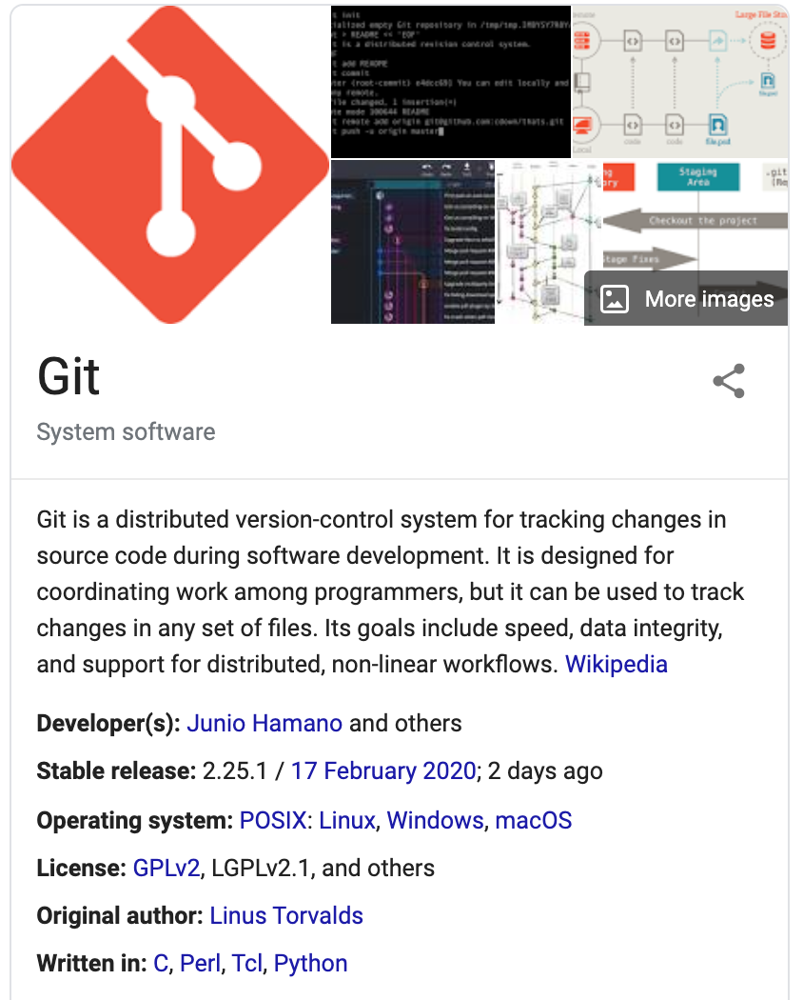

```{r setup, include=FALSE}
knitr::opts_chunk$set(echo = FALSE)

library(tidyverse)
library(kableExtra)

```

# What's all the excitement about?

Data analysis is often collaborative. Sometimes this collaboration involves a team of programmers simultaneously contributing code to the same project, even the same document.  In other cases, the collaboration may be asynchronous or an analyst may decide to continue work left behind by someone else. 

Rather than save many independent copies of each file, many version control software tools simply track incremental changes to the files under version control. Storing a complete record of *changes* from one version to the next is far more efficient than saving many copies of whole documents for which a majority of the content may be unchanged from one iteration to the next.  Moreover, with a complete record of every incremental change, it's just as easy to piece together the current state of a document or to rebuild a previous the state of a document at an earlier point recorded in it's development lifecycle.

Computational reproducibility generally provides an opportunity to demonstrate the accuracy of your code & methods according to some stated purpose, and allows others the opportunity to make use of your work whether to directly replicate some part of it or to extend and modify your work for a new purpose. We bolster the integrity of our work when we strive to preserve a complete and transparent record of all actions in a project from raw source data through final product. 


# Collaboration


<iframe width="840" height="470" src="https://www.youtube.com/embed/aHSUp7msCIE?start=33" frameborder="0" allow="accelerometer; autoplay; encrypted-media; gyroscope; picture-in-picture" allowfullscreen></iframe>


# Time travel


{ width=80% }

# Reproducibility

{ width=80% }


# Introducing Git...

{ width=50% }


# Back to the resource page...

- First exposure to GitHub
- RStudio Cloud + Git
- Deploying assignment Repos
    - student view
    - instructor view
    - individual & group assignments
- Assessment remarks


