# Prerequisites

- GitHub user id (if you haven't done so already)
- (recommended) photo of your faculty ID to request education benefits

# In GitHub...

0. Login 
1. Create new organization in GitHub
    - select the "+" in the upper right of the screen and choose "new organization"
    - you will create a new organization for each class
    - the organization is linked to your github profile and will house the student repositories created through GitHub Classroom

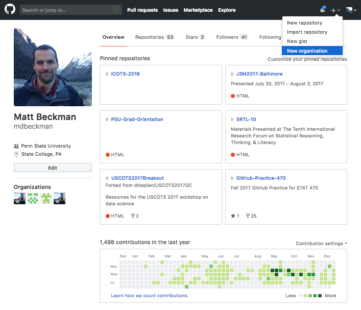{width=80%}

 

2. Set up the organization
    - the free version is sufficient
    - you can request free unlimited private repositories through GitHub Education later

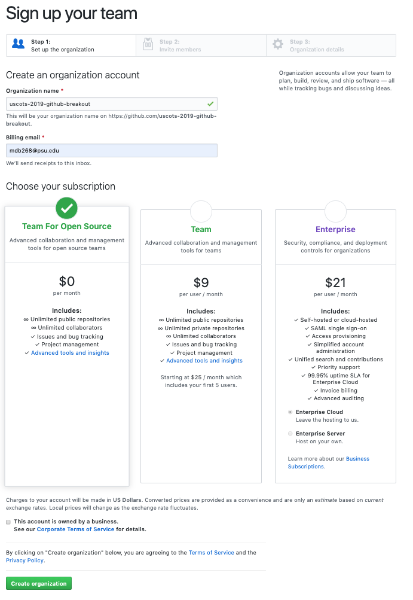{width=70%}

 

3. Skip the prompt to "invite members" to your organization (select "Continue")
    - students will NOT be "members" of the organization
    - students will become "outside collaborators" when later added through GitHub Classroom 

.png){width=80%}

 

4. Populate organization details
    - mark that the organization is for educational use
    - mark length of time for your class
    - mark number of users (class enrollment)

 

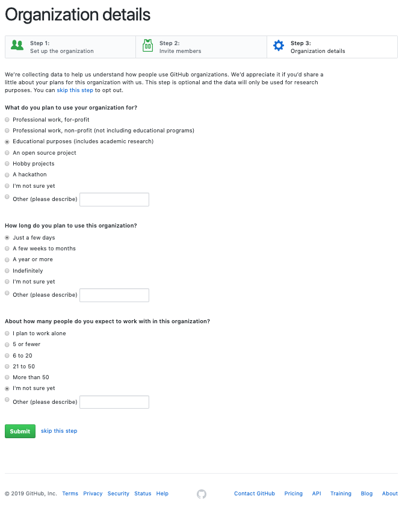{width=80%}

 

# In GitHub Classroom...

5. GitHub Classroom Sign In (using GitHub credentials)
6. Initate a "New Classroom" from GitHub Classroom landing page

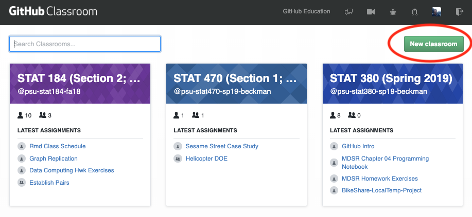{width=80%}

 

7. Grant GitHub Classroom access to the GitHub organization created previously
    - The organizations shown (if any) have already been configured for access from GitHub Classroom
    - Newly initiated organizations will not populate on the list yet
    - Choose "Grand access to an organization that is not listed"

 

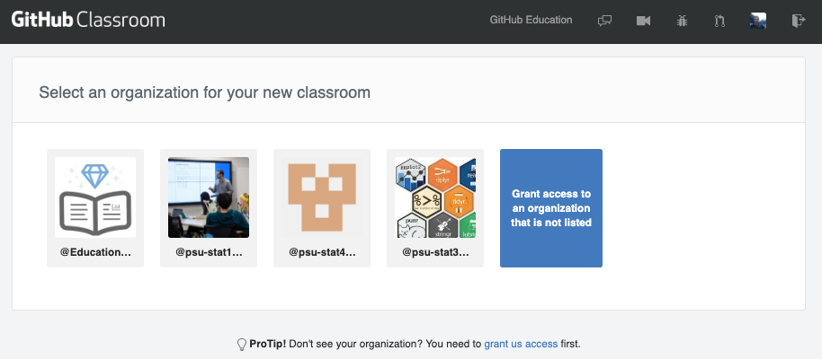{width=80%}

 

8. Grant access to GitHub organization
    - GitHub Classroom will populate a list of organizations associated with your GitHub credentials
    - Click "Grant" next to the organization you want affiliated with your class
    - You may also "Revoke" access if needed
9. You will be prompted for your GitHub credentials 

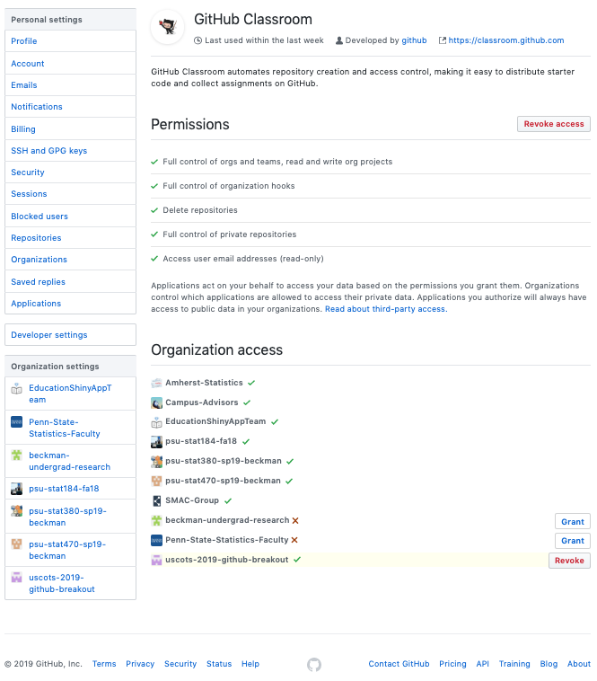{width=80%}

 

10. Select GitHub organization for your class
    - back to GitHub Classroom main page (may need to refresh page)
    - your newly configured organization should be among the available options
11. You will be prompted to rename your classroom (can be changed later if necessary)
12. You will have an opportunity to invite other administrators (can be invited later if necessary)

 

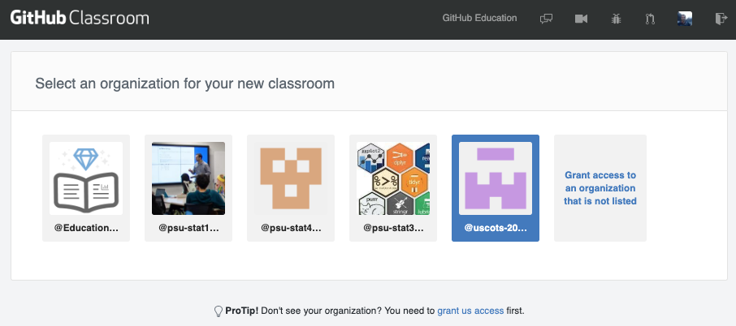{width=80%}

 

13. Set up class roster in GitHub Classroom
    - this step is optional, and can be revisited later

 

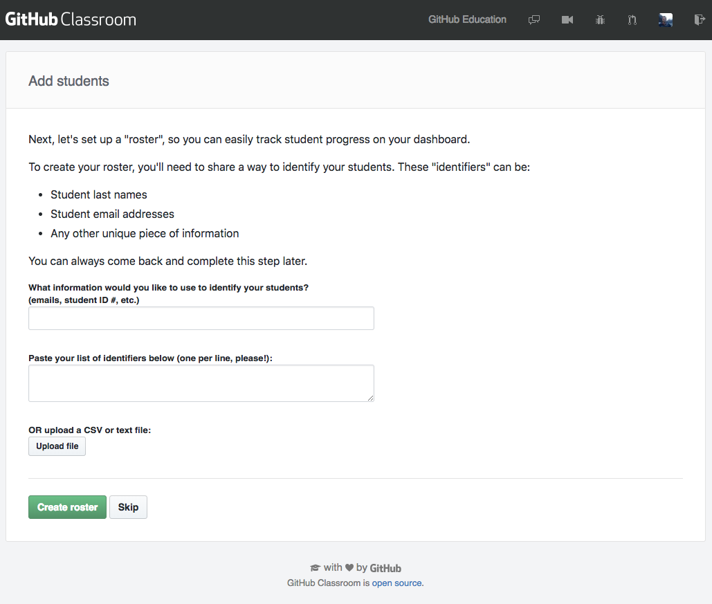{width=80%}

 

# (Recommended) GitHub Education Benefits

14. Initiate GitHub Education Benefits
    - unlimited **private** repositories 
    - unlimited collaborators (students)
    - click the (well camouflaged) link or Internet search "github education"
    - [https://education.github.com](https://education.github.com)

 

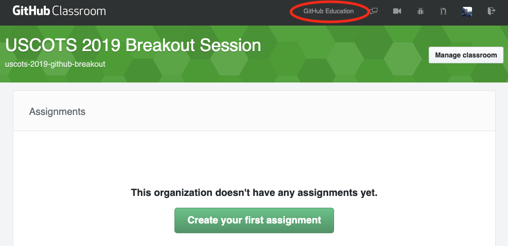{width=80%}

 

15. Apply for GitHub Education Benefits

 

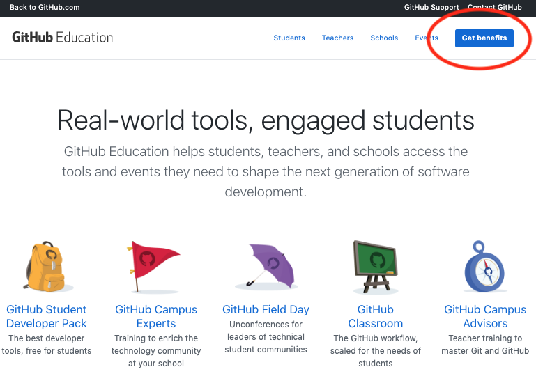{width=80%}

 

15. Apply for GitHub Education Benefits
16. Follow prompts to identify the github organization and describe your use
17. You may need to show proof of academic status (e.g., upload photo of institution ID)
    - verification of faculty status may take a few business days 
    - verification retained to expedite future requests 
18. Upgrade your organization once you are verified as faculty

 

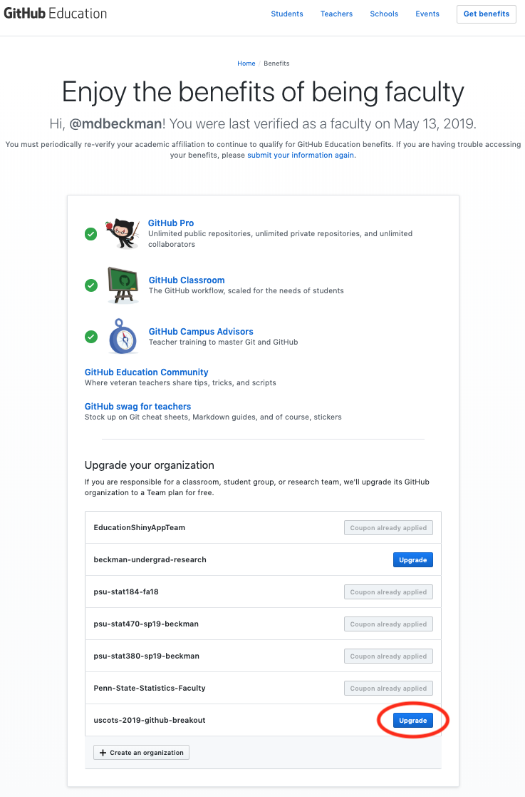{width=80%}

 

# Creating an assignment in GitHub Classroom

19. Create your first assignment
    - Choose "individual" or "group assignment"
        - individual: each student has their own repository for the assignment
        - group: the group will have a shared repository for the assignment

 

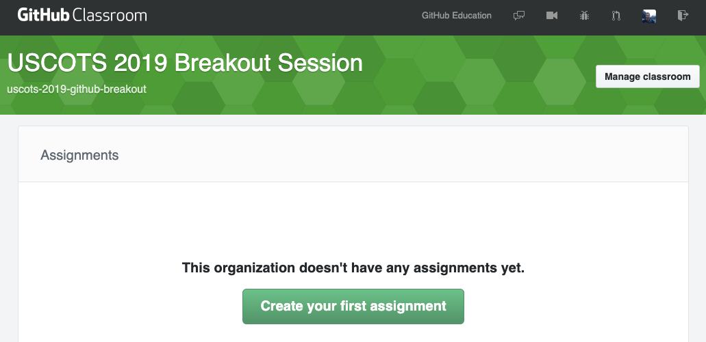{width=80%}

 

20. Configure GitHub Classroom Assignment
    - create concise assignment title
    - choose public vs private--should student work be visible to public, including other students?
    - determine whether students should have admin permissions on their repository, allowing them to
        - revoke instructor access
        - make private repo public
        - and more
    - enable assignment URL for easy distribution
    - you may initialize student repos with code, templates, data sets, etc 
        - imports contents of an existing GitHub Repo
        - can be a private repo associated with your own GitHub credentials
    - you can configure a due date in GitHub Classroom

 

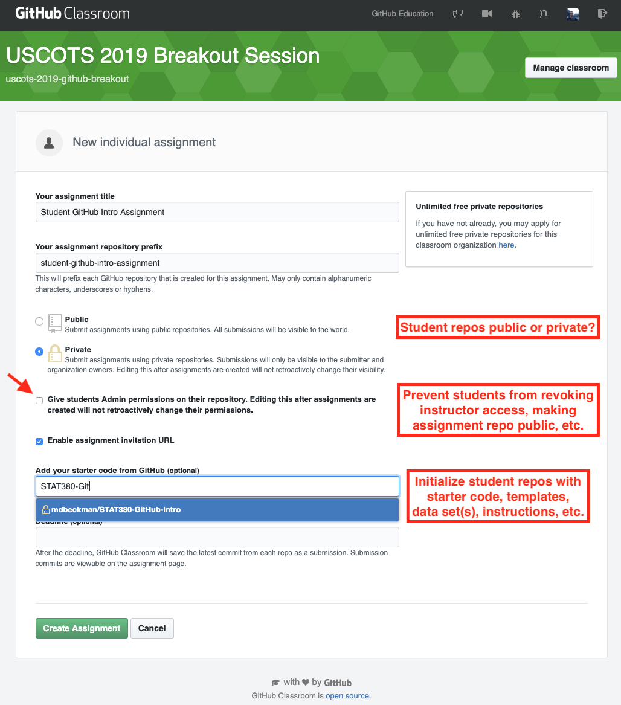{width=80%}

 

21. Deploy assignment to students!
    - invitation link can be posted in LMS, or otherwise distributed.
    - when students click the link they will be prompted to accept the assignment
    - once accepted, the assignment "clones" a version of the starter code (if provided) and initiates a new repo for the student
    - student is then provided a link to their new GitHub repository (within your controlled github organization linked to the class)

 

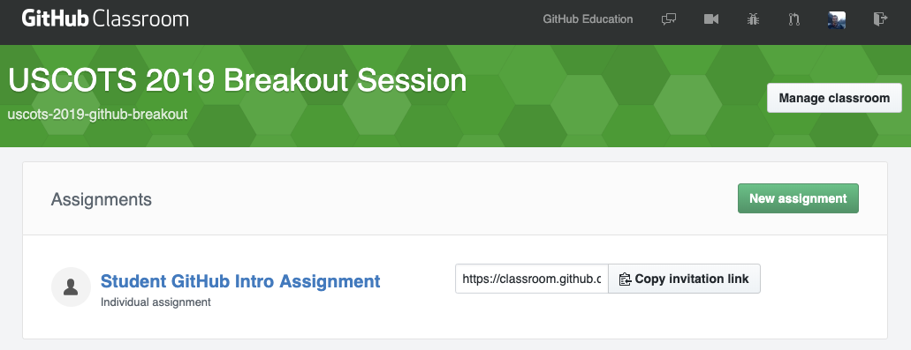{width=80%}

 

